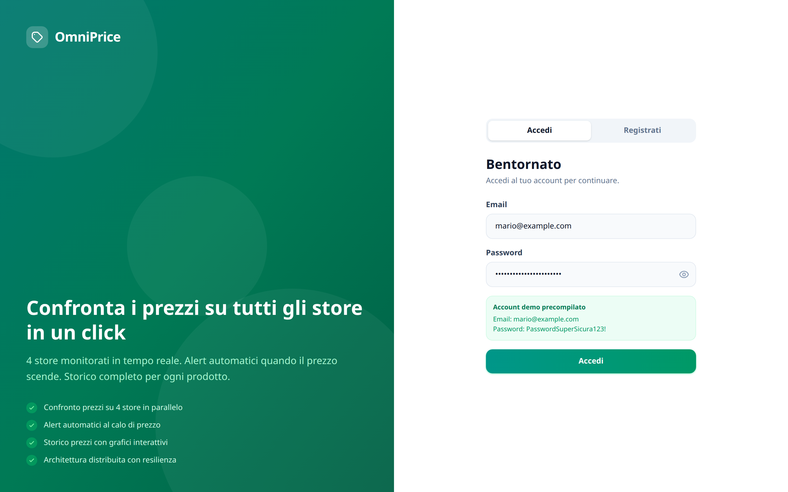
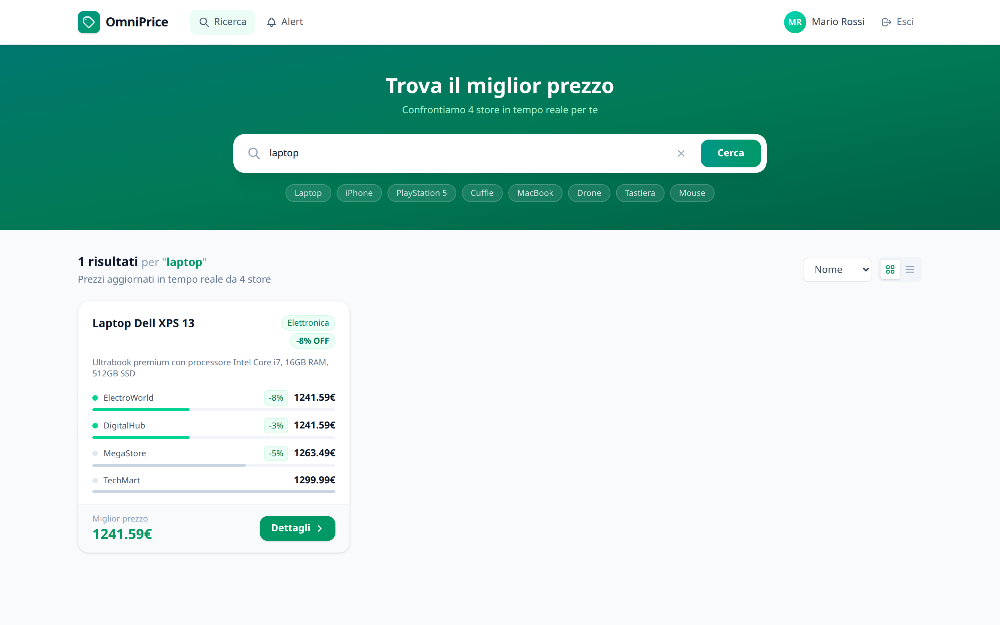
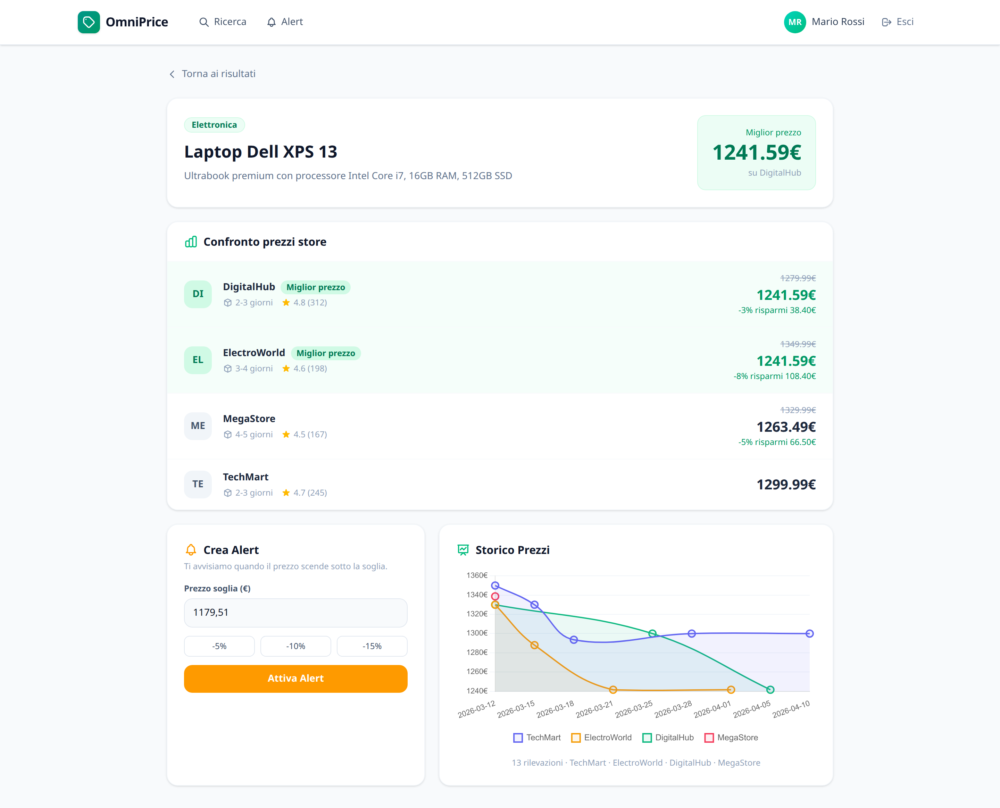
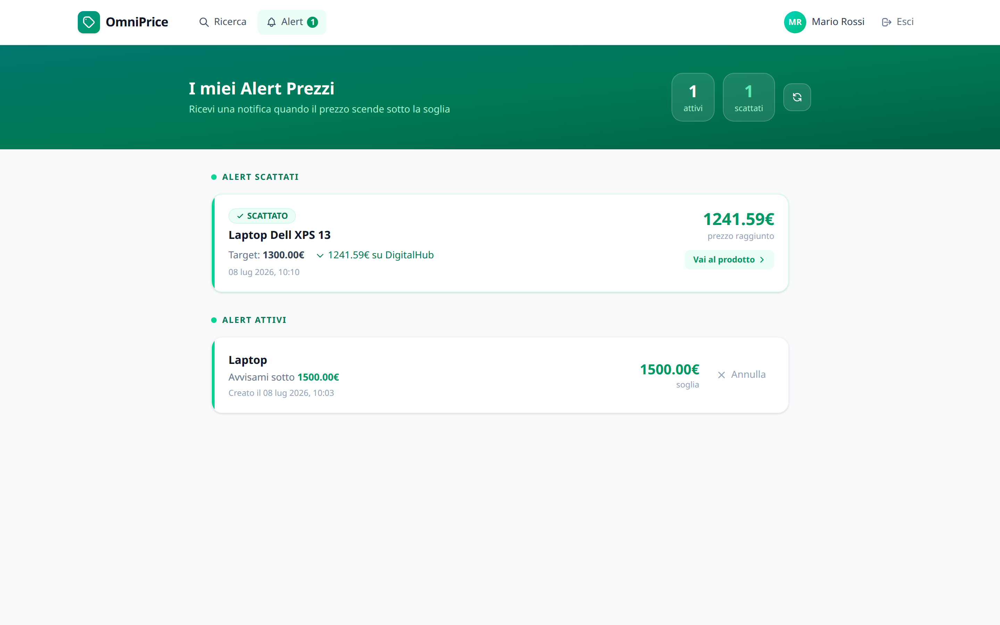
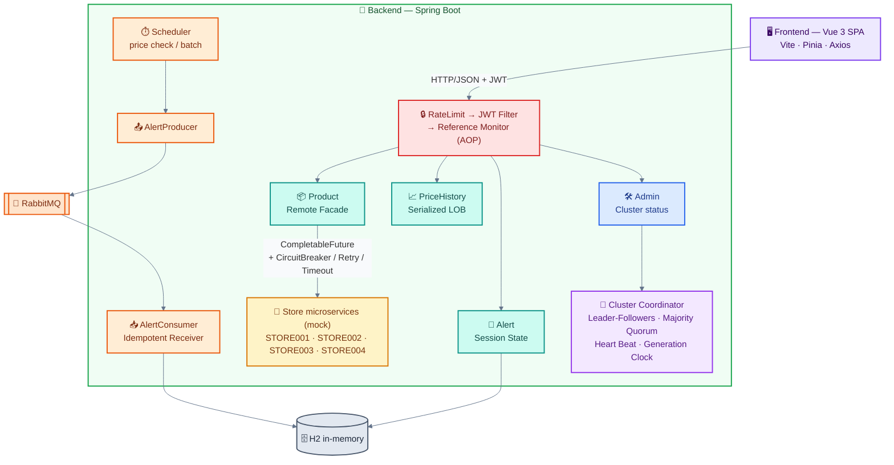
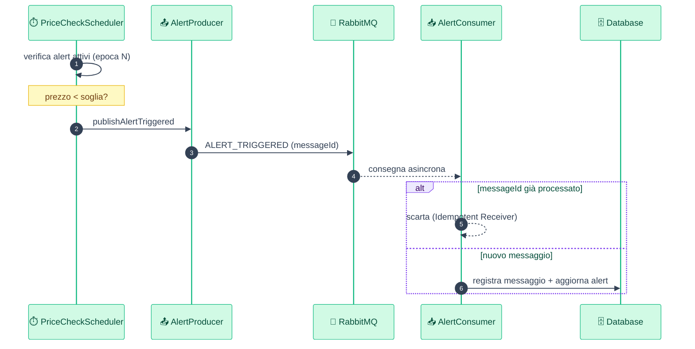
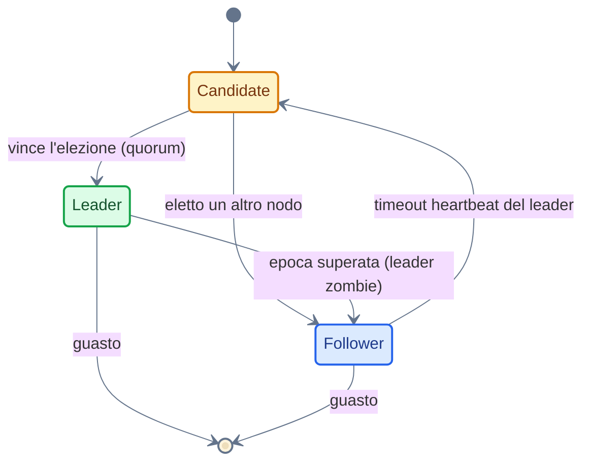

<div align="center">

# OmniPrice

**Sistema distribuito per il tracciamento dei prezzi su più piattaforme e‑commerce**

[](https://openjdk.org/)
[](https://spring.io/projects/spring-boot)
[](https://vuejs.org/)
[](https://www.rabbitmq.com/)
[](LICENSE)

*Progetto per il corso di **Ingegneria dei Sistemi Distribuiti** — Università degli Studi di Catania*

</div>

---

## Indice

- [Panoramica](#panoramica)
- [Demo](#demo)
- [Funzionalità](#funzionalità)
- [Architettura](#architettura)
- [Design pattern implementati](#design-pattern-implementati)
- [Stack tecnologico](#stack-tecnologico)
- [Avvio rapido](#avvio-rapido)
- [Configurazione](#configurazione)
- [Account demo](#account-demo)
- [API principali](#api-principali)
- [Struttura del progetto](#struttura-del-progetto)
- [Testing](#testing)
- [Autori](#autori)
- [Licenza](#licenza)

---

## Panoramica

**OmniPrice** è un'applicazione client‑server basata su architettura a microservizi che permette agli utenti di:

- **cercare prodotti** interrogando in parallelo diverse piattaforme e‑commerce (simulate da microservizi *mock* alimentati da dataset JSON);
- **confrontare i prezzi** in tempo reale e individuare il migliore;
- **consultare lo storico** delle variazioni di prezzo di ogni prodotto;
- **impostare alert personalizzati** che si attivano quando il prezzo scende sotto una soglia scelta.

L'obiettivo didattico è realizzare una comunicazione **robusta, asincrona e sicura** tra nodi distribuiti, affrontando problemi reali — latenza di rete, fallimento dei servizi esterni, concorrenza, coordinamento — attraverso l'applicazione rigorosa dei **design pattern** dei sistemi distribuiti.

I requisiti funzionali e non funzionali sono documentati in [`REQUIREMENTS.md`](REQUIREMENTS.md).

---

## Demo

> Interfaccia sviluppata in Vue 3 + Tailwind CSS. Le immagini sono catturate dall'applicazione in esecuzione.

### Login & registrazione
Autenticazione con hashing delle password (BCrypt) e rilascio di token JWT.



### Ricerca prodotti
Interrogazione **parallela** di 4 store via `CompletableFuture`, con aggregazione dei risultati in un unico DTO (Remote Facade).



### Dettaglio prodotto & storico prezzi
Confronto tra store e grafico dello storico prezzi caricato **on‑demand** (pattern Serialized LOB).



### Gestione alert
Alert personalizzati per utente; quelli scattati vengono elaborati tramite pipeline asincrona su RabbitMQ.



---

## Funzionalità

| Area | Descrizione |
|------|-------------|
| 🔐 **Autenticazione** | Login/registrazione con password hashing (BCrypt) e JWT stateless |
| 👥 **Ruoli** | Controllo accessi basato sui ruoli (`STANDARD`, `PREMIUM`, `ADMIN`) |
| 🔍 **Ricerca multi‑store** | Aggregazione parallela e resiliente dei prezzi da 4 store |
| 📈 **Storico prezzi** | Serie storica per prodotto/store, caricata su richiesta |
| 🔔 **Alert di prezzo** | Notifiche asincrone quando il prezzo scende sotto la soglia |
| 🛡️ **Resilienza** | Circuit Breaker, Retry e Timeout su ogni chiamata di store |
| 🧭 **Coordinamento** | Cluster con elezione del leader, quorum ed epoche (Generation Clock) |
| 📊 **Pannello admin** | Endpoint di monitoraggio di cluster, worker pool ed heartbeat |

---

## Architettura

### Vista dei componenti



> Il sistema funziona anche in **modalità degradata** senza RabbitMQ (`omniprice.rabbitmq.enabled=false`): in tal caso la pipeline di notifiche viene eseguita in‑process.

### Pipeline di notifica di calo prezzo (asincrona)



### Ciclo di vita di un nodo del cluster



---

## Design pattern implementati

Ogni pattern corrisponde a un argomento del corso di Ingegneria dei Sistemi Distribuiti (Prof. E. Tramontana).

### Sicurezza e controllo accessi
| Pattern | Implementazione |
|---------|-----------------|
| **Authentication & Hashing** | `SecurityConfig` (BCrypt), `AuthController`, `UserDetailsServiceImpl` |
| **Token (JWT)** | `JwtUtil`, `JwtAuthFilter` |
| **Role‑Based Access Control** | Ruoli nei claim JWT + `@RequiresRole` |
| **Reference Monitor (AOP)** | `SecurityAspect` intercetta ogni metodo protetto |
| **Rate Limiting / Authenticator** | `LoginRateLimitFilter` (Resilience4J) davanti al login |

### Interfaccia e trasferimento dati
| Pattern | Implementazione |
|---------|-----------------|
| **Remote Facade + DTO** | `ProductController`/`ProductService` aggregano i microservizi in DTO leggeri |
| **Serialized LOB** | `PriceHistoryController` — storico serializzato e trasferito on‑demand |
| **Session State** | `AlertController`/`AlertService` — stato degli alert per utente |

### Asincronia e resilienza
| Pattern | Implementazione |
|---------|-----------------|
| **CompletableFuture** | `StoreService` interroga i 4 store in parallelo |
| **Circuit Breaker / Retry / Timeout** | `StoreService` con Resilience4J (istanze isolate per store) |

### Messaggistica asincrona (RabbitMQ)
| Pattern | Implementazione |
|---------|-----------------|
| **Request Pipeline** | `PriceCheckScheduler` → `AlertProducer` → RabbitMQ → `AlertConsumer` |
| **Idempotent Receiver** | `AlertConsumer` + `ProcessedMessage` (deduplicazione per `messageId`) |
| **Request Batch** | `BatchWriteScheduler` raggruppa le scritture in un unico messaggio |

### Coordinamento dei nodi distribuiti
| Pattern | Implementazione |
|---------|-----------------|
| **Leader‑Followers** | `ClusterCoordinator` (consenso) e `WorkerPool` (concorrenza a thread) |
| **Majority Quorum** | Scritture confermate solo con la maggioranza dei nodi |
| **Heart Beat** | `HeartBeatService` per la failure detection |
| **Generation Clock** | `GenerationClockService` — epoche per neutralizzare il *leader zombie* |

---

## Stack tecnologico

| Livello | Tecnologie |
|---------|-----------|
| **Frontend** | Vue 3, Vite, Vue Router, Pinia, Axios, Chart.js, Tailwind CSS |
| **Backend** | Java 17, Spring Boot, Spring Security, Spring AMQP, Spring AOP |
| **Resilienza** | Resilience4J (Circuit Breaker, Retry, Rate Limiter) |
| **Messaging** | RabbitMQ |
| **Persistenza** | H2 (in‑memory), Spring Data JPA |
| **Sicurezza** | JWT (jjwt), BCrypt |
| **Build & tooling** | Maven Wrapper, npm, Docker Compose |

> Le dipendenze runtime sono dichiarate in `backend/omniprice/pom.xml` (Maven) e `frontend/package.json` (npm).

---

## Avvio rapido

### Prerequisiti
- **Java 17+**
- **Node.js 18+** e npm
- **Docker** (opzionale, per RabbitMQ)

### 1. Clona il repository
```bash
git clone https://github.com/giuliopedicone02/OmniPrice.git
cd OmniPrice
```

### 2. (Opzionale) Avvia RabbitMQ
```bash
docker compose up -d
# Management UI: http://localhost:15672  (guest / guest)
```

### 3. Backend
```bash
cd backend/omniprice
./mvnw spring-boot:run
# con RabbitMQ attivo:
./mvnw spring-boot:run -Dspring-boot.run.arguments=--omniprice.rabbitmq.enabled=true
```
Il backend è disponibile su **http://localhost:8080/api**.

### 4. Frontend
```bash
cd frontend
npm install
npm run dev
```
Il frontend è disponibile su **http://localhost:5173**.

### Avvio con un solo comando
Dalla root del progetto:
```bash
./script.sh   # avvia backend e frontend insieme
```

---

## Configurazione

I parametri principali si trovano in `backend/omniprice/src/main/resources/application.properties` e sono sovrascrivibili da riga di comando o variabili d'ambiente. Vedi [`.env.example`](.env.example) per l'elenco completo.

| Proprietà | Default | Descrizione |
|-----------|---------|-------------|
| `omniprice.jwt.secret` | *(dev)* | Chiave di firma JWT (Base64). **Da cambiare in produzione.** |
| `omniprice.jwt.expiration` | `86400000` | Durata token (ms) |
| `omniprice.rabbitmq.enabled` | `false` | Abilita la pipeline RabbitMQ |
| `omniprice.store.timeout-seconds` | `3` | Timeout per chiamata store |
| `omniprice.ratelimit.login.limit-for-period` | `5` | Tentativi di login per IP nel periodo |
| `omniprice.scheduler.price-check-cron` | `0 */5 * * * *` | Frequenza controllo prezzi |
| `omniprice.scheduler.batch-write-cron` | `0 */2 * * * *` | Frequenza scrittura batch |

> ⚠️ La chiave JWT presente nel repository è solo per lo sviluppo locale: sostituiscila con un segreto proprio prima di qualsiasi deploy.

---

## Account demo

Utenti creati automaticamente all'avvio (`DataInitializer`):

| Email | Password | Ruolo |
|-------|----------|-------|
| `mario@example.com` | `PasswordSuperSicura123!` | STANDARD |
| `laura@example.com` | `Password123!` | PREMIUM |
| `admin@example.com` | `Admin1234!` | ADMIN |

---

## API principali

Base URL: `http://localhost:8080/api`

| Metodo | Endpoint | Ruolo | Descrizione |
|--------|----------|-------|-------------|
| `POST` | `/auth/register` | pubblico | Registrazione utente |
| `POST` | `/auth/login` | pubblico | Login → token JWT |
| `GET`  | `/products/search?q=` | autenticato | Ricerca prodotti multi‑store |
| `GET`  | `/products/{id}` | autenticato | Dettaglio prodotto |
| `GET`  | `/price-history/{id}` | autenticato | Storico prezzi (Serialized LOB) |
| `GET`  | `/alerts` | autenticato | Alert dell'utente |
| `POST` | `/alerts` | autenticato | Crea alert |
| `DELETE` | `/alerts/{id}` | autenticato | Elimina alert |
| `GET`  | `/admin/cluster` | ADMIN | Stato del cluster |
| `POST` | `/admin/cluster/write` | ADMIN | Scrittura con quorum |
| `POST` | `/admin/cluster/fail/{nodeId}` | ADMIN | Simula guasto nodo → elezione |
| `GET`  | `/admin/status` | ADMIN | Worker pool + heartbeat |

Esempio:
```bash
# Login
TOKEN=$(curl -s -X POST http://localhost:8080/api/auth/login \
  -H 'Content-Type: application/json' \
  -d '{"email":"mario@example.com","password":"PasswordSuperSicura123!"}' | jq -r .token)

# Ricerca
curl -s "http://localhost:8080/api/products/search?q=laptop" \
  -H "Authorization: Bearer $TOKEN"
```

---

## Struttura del progetto

```
OmniPrice/
├── backend/omniprice/          # Applicazione Spring Boot
│   └── src/main/java/com/unict/dmi/omniprice/
│       ├── annotation/         # @RequiresRole
│       ├── aspect/             # SecurityAspect (Reference Monitor)
│       ├── cluster/            # ClusterCoordinator, ClusterNode (consenso)
│       ├── config/             # Security, RabbitMQ, Async, DataInitializer
│       ├── controller/         # Remote Facade (REST)
│       ├── distributed/        # HeartBeat, GenerationClock, WorkerPool
│       ├── dto/                # Data Transfer Object
│       ├── messaging/          # Producer/Consumer RabbitMQ
│       ├── scheduler/          # PriceCheck, BatchWrite
│       ├── security/           # JWT, filtri, rate limiting
│       └── service/            # Logica di dominio
├── frontend/                   # SPA Vue 3
│   └── src/{components,router,services,store}
├── dataset/                    # Dataset JSON (cataloghi, prezzi, storico)
├── docs/screenshots/           # Immagini della demo
├── docker-compose.yml          # RabbitMQ
└── script.sh                   # Avvio combinato backend + frontend
```

---

## Testing

```bash
cd backend/omniprice
./mvnw test
```
La suite include i test del `ClusterCoordinator` (elezione del leader, quorum, rifiuto del leader zombie tramite Generation Clock).

---

## Autori

- **Giulio Pedicone** — [@giuliopedicone02](https://github.com/giuliopedicone02)
- **Francesco Prospero Antonio Virzì**

Progetto realizzato per il corso di *Ingegneria dei Sistemi Distribuiti*, Corso di Laurea Magistrale in Informatica, Università degli Studi di Catania.

---

## Licenza

Distribuito con licenza **MIT**. Vedi il file [`LICENSE`](LICENSE) per i dettagli.
